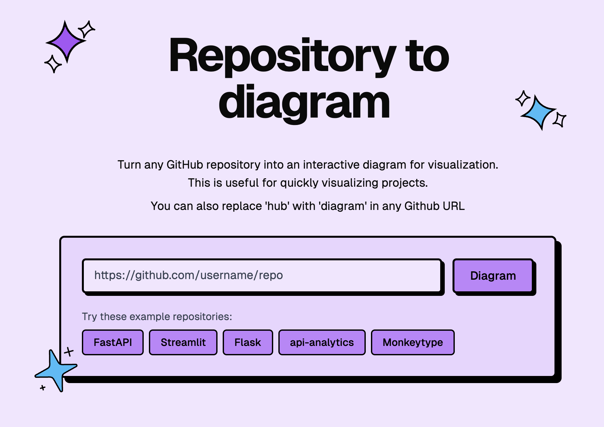

# gnu.in.labs / diagram studio

Turn a GitHub repository into an interactive architecture diagram and a written
explanation of how it is put together — on your own machine.

It is a local desktop application. The server that draws the diagrams starts
with the app and listens on `127.0.0.1` only. By default the model that writes
them is Ollama on `127.0.0.1:11434`, so nothing about your repositories leaves
the computer.



## What it does

- **Interactive diagrams.** Every component links to its code on GitHub. Click a
  node, read the graph, open the file.
- **Written explanations.** How the codebase is organised, what the main parts
  are, how they connect — generated from the repository itself, not from a
  summary of its README.
- **A local MCP endpoint.** AI assistants read the same diagrams over
  `http://127.0.0.1:7421/mcp`, on the port you confirm at first launch.
- **Private repositories.** Supply a GitHub token; the diagram is kept separately.
- **Two languages.** English and French, switchable from the settings dialog.

## Install

Build the packages yourself — there is no download service:

```bash
git clone https://github.com/tension-atoi/diagram.studio
cd diagram.studio
bun install
bun run electron:build
```

That produces three targets in `dist-electron/`:

| Target | File |
|---|---|
| AppImage | `gnu.in.labs Diagram Studio-0.1.0.AppImage` |
| deb | `gnu-in-labs-diagram-studio_0.1.0_amd64.deb` |
| tar.gz | `gnu-in-labs-diagram-studio-0.1.0.tar.gz` |

Run the AppImage directly, or mount it if FUSE is unavailable:

```bash
./gnu.in.labs\ Diagram\ Studio-0.1.0.AppImage --appimage-extract-and-run
```

To inspect the deb without installing it system-wide:

```bash
dpkg-deb -x gnu-in-labs-diagram-studio_0.1.0_amd64.deb /tmp/studio
```

The app needs no `node` on the machine: it re-uses the Electron binary as the
Node runtime.

## First launch

The app asks one question, then never again: **which local port should it
listen on?** The default is `7421`. The answer is stored in `config.json` in the
application-data directory, and both the app and any MCP client read the
endpoint from there.

It also mints a signing secret on first run, readable only by your user account.
Diagrams it draws are written to `~/.cache/gnu-in-labs-diagram-studio/`, and
**Library** in the navigation lists everything stored there.

The status bar along the bottom reports what is actually running:

| It reads | Meaning |
|---|---|
| `CHECKING ENGINE` | the app has not answered yet |
| `OLLAMA LOCAL : 11434` | Ollama is up with the configured model |
| `OLLAMA NOT REACHING` | start it with `ollama serve` |
| `MODEL NOT PULLED` | `ollama pull qwen3.6:35b-studio` |
| `JEV VERIFIER OFF` | no TypeSafe key, so semantic verification is not running |

## The local engine

Ollama is a precondition, not something the app manages. It reports whether the
daemon answers and whether the model is pulled, and generation failures name the
endpoint and the fix rather than surfacing a raw connection error.

Hosted providers are available in the settings — OpenRouter, or any
OpenAI-compatible service. Choosing one sends the relevant parts of a repository
to that provider, under its terms. That is the one place repository content can
leave the machine, and it is your choice.

The optional TypeSafe/Jev semantic verifier stays off unless you configure a
key; the packaged app ships without one.

## Development

```bash
bun install
bun run electron:dev   # MCP app → next dev → Electron, one command
```

Web-only development is `bun run dev` on port 3000.

### Verify

```bash
bun run verify
```

`format:check`, `lint`, `typecheck`, `knip`, then the test suite **twice** — the
suite wipes its cache between runs, and one green run can hide state leaking
across runs. The bar is zero failures on two consecutive runs.

This machine is the bench. There is no hosted CI in this repository, and when
GitHub Actions is introduced it will only publish builds already proven locally.

Two traps, both documented in [docs/dev-setup.md](docs/dev-setup.md): do not run
the suite with `bun run --bun vitest` (Bun's globals break jsdom), and call
`cleanup()` in `afterEach` in component tests, since vitest globals are off and
Testing Library's automatic cleanup never registers.

## Documentation

- [docs/dev-setup.md](docs/dev-setup.md) — environment, commands, packaging, verify
- [docs/architecture.md](docs/architecture.md) — how the application is put together
- [docs/decisions/embedded-local-engine.md](docs/decisions/embedded-local-engine.md) — why the engine ships inside the app
- [docs/operations/traffic-protection.md](docs/operations/traffic-protection.md) — caching and page regeneration

## License

MIT. See [LICENSE](LICENSE).